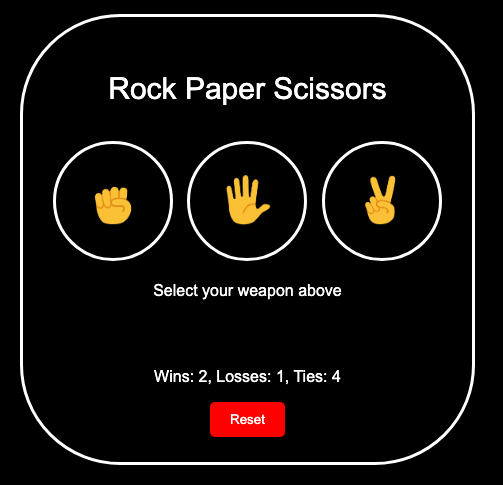

# 🧠 My JavaScript Projects — Course Portfolio

A collection of web projects completed throughout the course: [Learn JavaScript – Full Course for Beginners](https://www.youtube.com/watch?v=EerdGm-ehJQ). Each project demonstrates key concepts like DOM manipulation, event handling, and logic using vanilla JavaScript.

---

## 🧩 Projects Overview

### **Rock Paper Scissors**
- A classic game built using HTML, CSS, and JavaScript.
- Features:
  - User vs Computer choice with emojis
  - Score tracking (wins, losses, ties)
  - Visual feedback for selected button
  - Reset functionality to clear score



### **To-Do List App**
- A simple task management tool using HTML, CSS, and JavaScript.
- Features:
  - Add tasks with optional due dates
  - Clean input grid layout using CSS Grid
  - Tasks displayed in a dynamic list with date
  - Remove button to delete individual tasks
  - Responsive and minimal design


> _Add more projects here as you complete them (e.g., Calculator, Quiz App, To-Do List)_

---

## ⚙️ Technologies Used

- **HTML5**, **CSS3**, **JavaScript (ES6+)**
- Browser APIs: `DOM`, `localStorage`
- No external libraries or frameworks


---
## 🚀 Getting Started

### Prerequisites

- A modern web browser (Chrome, Firefox, Edge)
- Optional: [VS Code](https://code.visualstudio.com/) with Live Server extension

### Run Locally

```bash
# Clone the repo
git clone https://github.com/your-username/your-repo-name.git
cd your-repo-name

# Open index.html in your browser
open index.html

# OR use Live Server in VS Code
